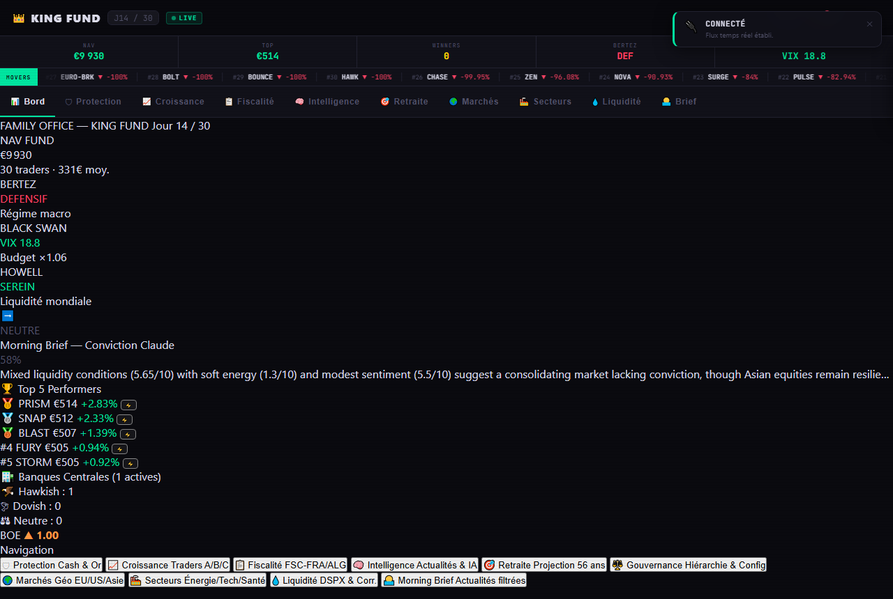
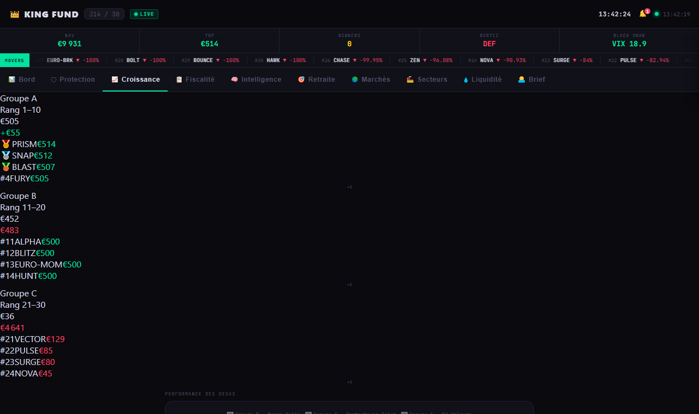
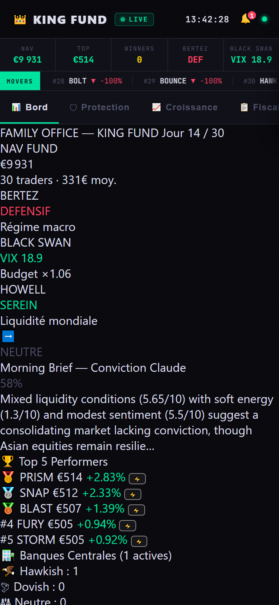
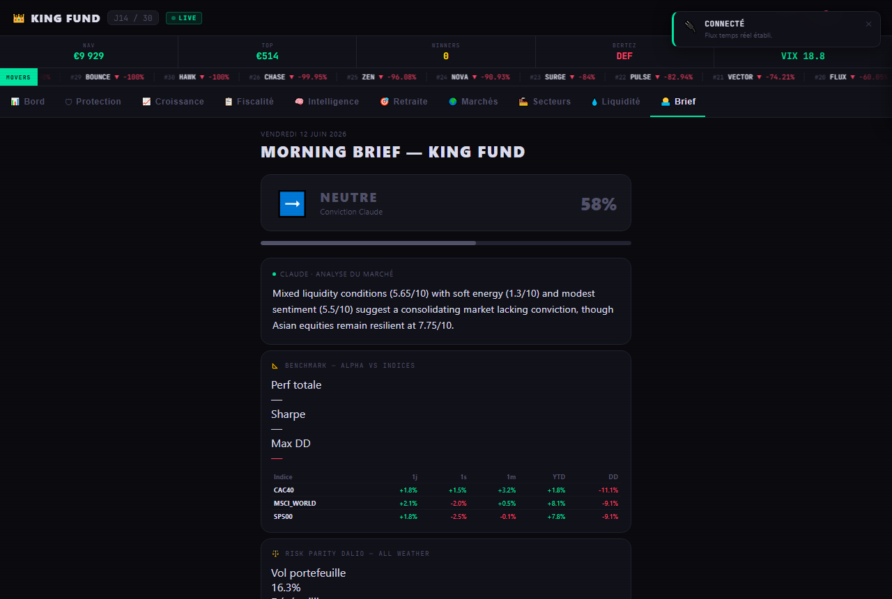
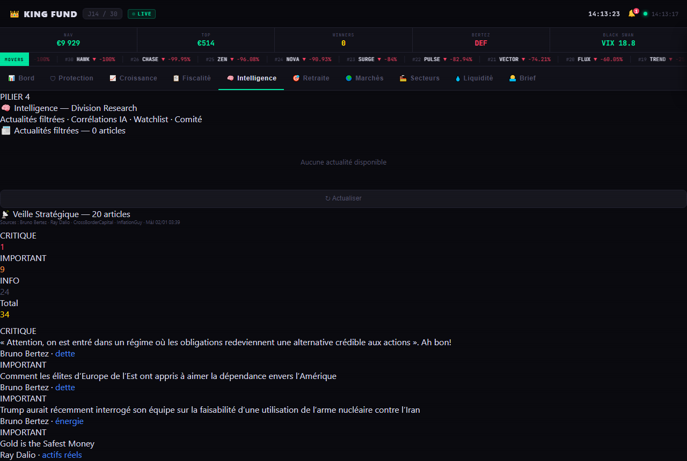
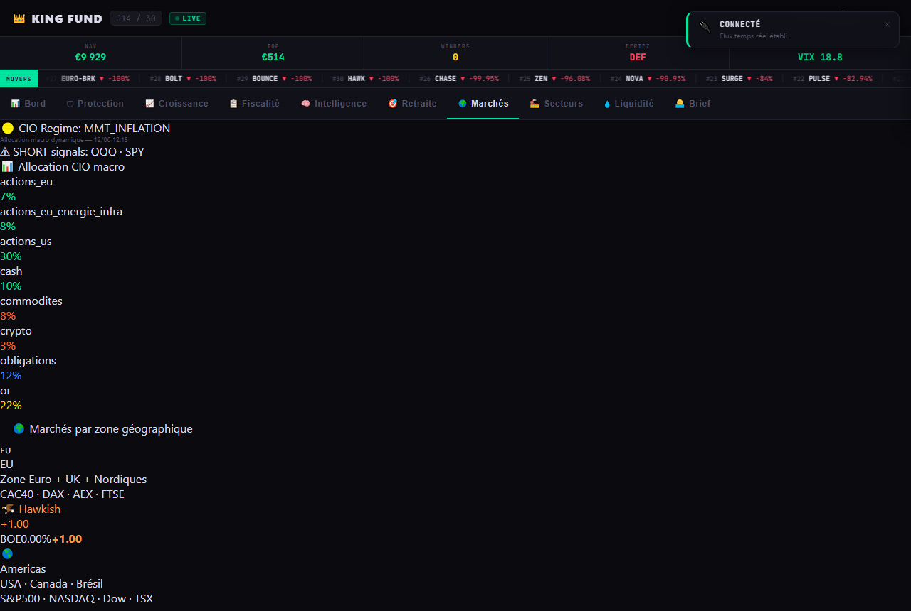
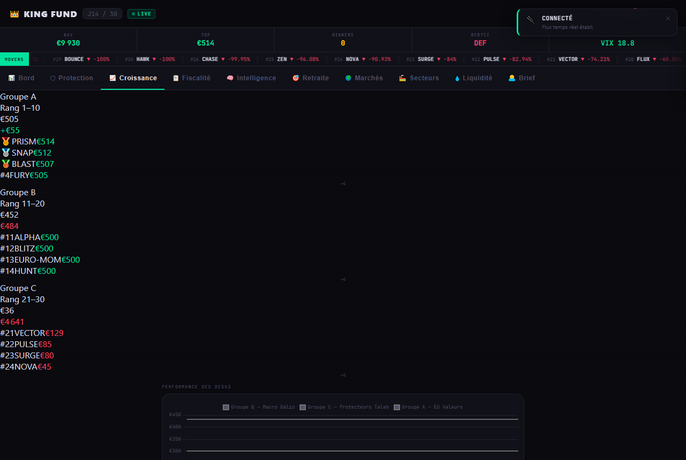
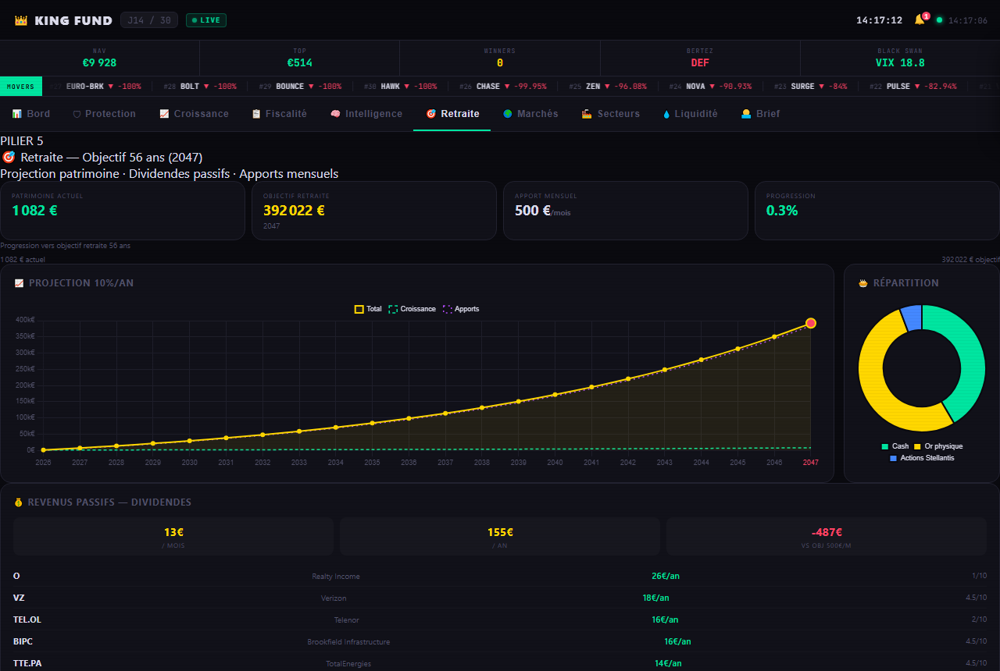

# 👑 King Fund — Family Office IA

> **30 traders IA** partent chacun de **500 €** et visent **10 000 €** en 30 jours.  
> Un Gérant Délégué autonome (AGD-01), un Comité de Sélection à 3 experts, et un suivi patrimonial complet.

<p align="center">
  
</p>

<p align="center">
  
  &nbsp;&nbsp;
  
</p>

<p align="center">
  
  &nbsp;&nbsp;
  
  &nbsp;&nbsp;
  
</p>

---

## Démarrage rapide

```bash
# 1. Dépendances
pip install flask flask-cors flask-sock apscheduler pytz yfinance fpdf2

# 2. Configurer les clés API (copier .env.example → .env)
cp backend/.env.example backend/.env
# Renseigner : WEB_PASSWORD, ANTHROPIC_API_KEY, TELEGRAM_BOT_TOKEN, TELEGRAM_CHAT_ID

# 3. Lancer le backend
python -X utf8 backend/app.py

# 4. Ouvrir dans le navigateur
# http://localhost:5000
```

> **Accès mobile (Wi-Fi local) :** `http://192.168.1.X:5000` — puis *Ajouter à l'écran d'accueil* pour une icône PWA.

---

## Ce que fait King Fund

King Fund est à la fois un **simulateur de battle trading IA** et un **family office personnel**. Il tourne en continu sur votre machine et gère trois couches :

| Couche | Description |
|---|---|
| **Battle trading** | 30 traders IA en compétition, tick toutes les 60s, sélection naturelle, élimination J15 si < 300€ |
| **Gestion patrimoniale** | Watchlist Graham 16 actifs, screener mondial 120 titres, suivi PRU, projection retraite 2041 |
| **Surveillance & alertes** | Morning Brief 06h30, Veille Stratégique horaire, alertes Telegram temps réel, backup quotidien |

---

## Architecture

```
king-fund/
├── backend/
│   ├── app.py                          # Flask — REST + WebSocket + auth
│   ├── engine.py                       # Moteur tick : 30 traders, Black Swan, sélection naturelle
│   ├── watchdog.py                     # Surveillance santé (ping /health toutes les 5 min)
│   │
│   ├── traders/
│   │   ├── base_trader.py              # Classe abstraite : portfolio, decide(), feedback loop
│   │   └── trader_01..30.py            # 30 traders concrets
│   │
│   ├── divisions/
│   │   ├── bus/                        # MessageBus Pub/Sub inter-agents (thread-safe)
│   │   ├── banques_centrales/          # 20 banques centrales — sentiment RSS, taux FRED
│   │   ├── middle_office/
│   │   │   ├── desk_liquidite/         # 7 agents liquidité (Yahoo, FRED, CoinGecko)
│   │   │   ├── agent_dspx.py           # Dispersion DSPX — signal STOCK_PICKING / BETA_ONLY
│   │   │   └── agent_correlations_actoblig.py  # Régime inflation (SPY/TLT FRED)
│   │   ├── investissement/
│   │   │   ├── pipeline.py             # 17 étapes Graham-Buffett-Damodaran, score 0-100
│   │   │   ├── watchlist.py            # 16 actifs watchlist (DCF + WACC Damodaran)
│   │   │   ├── screener_mondial.py     # 120 titres Euronext/Oslo/NYSE → top 50 Graham
│   │   │   └── agent_bertez.py         # Thèse Bertez : WTI + USD → régime macro
│   │   ├── cio/
│   │   │   └── allocation_macro.py     # 4 régimes : RISK_ON / MMT_INFLATION / NEUTRAL / RISK_OFF
│   │   ├── gerant_delegue/
│   │   │   ├── agd_01.py               # AGD-01 — veto émotionnel Claude Opus, rapport lundi
│   │   │   ├── comite_selection.py     # Vote 3/3 Research + CIO + Fiscaliste
│   │   │   ├── audit_agd.py            # Journal audit JSONL tamper-evident (SHA-256)
│   │   │   ├── agent_veille_strategique.py  # RSS Bertez/Dalio/Howell/InflationGuy
│   │   │   ├── agent_alertes_prix.py   # Seuils VPK/BIPC/DNB/TTE — anti-spam 1x/jour
│   │   │   └── agent_calendrier.py     # Earnings + dividendes (horizon 30j)
│   │   ├── alpha_lab/
│   │   │   ├── backtester.py           # Walk-forward 5 splits, t-stat, Sharpe IS/OOS
│   │   │   ├── valide_signaux.py       # Verdict VALIDE / BRUIT / OVERFITTE sur 6 crises
│   │   │   └── agent_facteurs.py       # Value / Momentum / Quality / LowVol — 13 actifs
│   │   └── rapports/
│   │       ├── rapport_investisseur.py # PDF lundi 09h00
│   │       ├── rapport_mensuel.py      # PDF 1er du mois 07h30
│   │       └── rapport_annuel.py       # PDF 31 déc. 18h00 (fiscal)
│   │
│   ├── data/
│   │   ├── market.py                   # Yahoo Finance (cache, rate-limit guard)
│   │   ├── liquidity_client.py         # Score liquidité global (singleton)
│   │   ├── expert_signal_client.py     # Bus signaux → 30 traders
│   │   ├── patrimoine.py               # Actifs, apports, projection retraite 2041
│   │   ├── suivi_pru.py                # PRU, PV/MV latentes, alertes objectif/stop
│   │   └── signal_history.py           # Historique prédictif signaux (Morning Brief, Bertez)
│   └── maintenance/
│       └── backup.py                   # Backup SQLite quotidien 04h00, rétention 30j
│
├── frontend/
│   ├── index.html                      # SPA mobile-first, 10 onglets, thème Bloomberg dark
│   └── assets/style.css               # Responsive 375px+
│
├── docs/                               # GitHub Pages (sync auto via CI)
├── database/king_fund.db               # SQLite — trades, snapshots, audit, éliminations
└── rapports/                           # PDF générés (investisseur/, mensuel/, annuel/)
```

---

## Les 6 divisions de traders

| Division | Couleur | Traders | Stratégie |
|---|---|---|---|
| Investissement | 🟡 or | 01, 05, 08, 13, 16, 20, 24, 25, 27, 28, 30 | Fondamentaux Graham / Buffett / Damodaran |
| Banque Centrale | 🔵 bleu | 04, 07, 17, 23, 29 | Macro FRED, taux directeurs, sentiment CB |
| Expert Tech | 🟢 vert | 02, 06, 10, 14, 22 | Actualités + momentum MSFT / NVDA / GOOGL |
| Expert Crypto | 🟣 violet | 03, 11, 15, 21, 26 | BTC / ETH, CoinGecko on-chain |
| Expert Commerce | 🟠 orange | 09, 12, 18 | AMZN / META, retail + social |
| Morning Brief | 🩷 rose | 19 | Outlook Claude API quotidien |

Chaque trader démarre à **500 €**. Les 5 meilleurs reçoivent ×1.20 sur leurs tailles de position ; les 5 pires ×0.50. Un trader éliminé (J15, < 300 €) est remplacé automatiquement avec un nouveau capital de 500 €.

---

## Le Bus inter-agents

Un MessageBus Pub/Sub relie les divisions en temps réel :

| Flux | Source → Cible | Intervalle |
|---|---|---|
| **CB Publisher** | 20 banques centrales → traders Banque Centrale | 60 ticks |
| **Expert Publisher** | ExpertSignalClient → traders Investissement | 30 ticks |
| **Desk Liq Budget** | Score liquidité global → facteur taille position [0.50 – 1.50] | 15 ticks |
| **Black Swan Agent** | VIX (^VIX Yahoo) → HALT tous traders si VIX ≥ 35, reset si ≤ 30 | 20 ticks |

---

## AGD-01 — Gérant Délégué

**Dr Alexandre Redon** (profil : PhD Finance MIT, CFA, FRM, 20 ans Bridgewater / Goldman / Scion).

| Fonction | Description |
|---|---|
| **Veto émotionnel** | Évalue chaque décision via Claude Opus → JSON `{decision, raison}` |
| **Rapport lundi** | Génère un rapport narratif Claude Opus + projection retraite 2041 |
| **Signal Howell** | DXY + VIX + EEM/SPY → régimes SEREIN / ATTENTION / VIGILANCE / DANGER |
| **SITG** | Bonus de performance : ×1.25 si +10–15%/an, ×1.50 si +15–25%/an, ×2.0 si +25%/an |
| **Journal audit** | JSONL append-only, chaîne SHA-256 — toute modification a posteriori est détectable |

### Comité de Sélection — Vote 3/3

Chaque soir à **23h00**, le Comité vote sur le top 3 de la watchlist :

| Expert | Critère de vote |
|---|---|
| **Research** | Score pipeline ≥ 7.0 + signal BUY → OUI automatique |
| **CIO** | Claude Sonnet — alignement macro Howell / Bertez / allocation |
| **Fiscaliste** | Claude Sonnet — Flat Tax 30%, DZD 15k/an, CERFA 3916 |

Verdict : **3/3 BUY CONFIRMÉ** → alerte Telegram critique | **2/3 BUY CONDITIONNEL** | **0–1/3 VETO**

---

## Dashboard — 10 onglets

<p align="center">
  
  &nbsp;&nbsp;
  
</p>

| Onglet | Contenu principal |
|---|---|
| 📊 **Bord** | NAV globale, top performers, signal Bertez, état Black Swan, score liquidité |
| 🛡 **Protection** | VIX live, Black Swan halt, gouvernance risques, état bus inter-agents |
| 📈 **Croissance** | Classement 30 traders par division, graphique performances, multiplicateurs sélection |
| 📋 **Fiscalité** | Flat Tax 30% CTO, or physique 11.5%, Stellantis PFU, CERFA 3916 DZD |
| 🧠 **Intelligence** | AGD-01 veto, Comité Sélection, Veille Stratégique, Alpha Lab, Journal Audit |
| 🎯 **Retraite** | Projection 2041, apports mensuels, suivi PRU positions réelles, PV/MV latentes |
| 🌍 **Marchés** | Indices Asie / Europe / US, Forex, Crypto, état 20 banques centrales |
| 🏭 **Secteurs** | Performances sectorielles, allocation CIO macro (4 régimes) |
| 💧 **Liquidité** | Score liquidité Howell, 7 agents desk, budget factor [0.50 – 1.50] |
| 🌅 **Brief** | Morning Brief 06h30 — direction marché, confiance, indices Asie, CB |


---

## Alertes Telegram

| Icône | Niveau | Déclencheur |
|---|---|---|
| 🚨 | **Critique** | Black Swan (VIX ≥ 35), seuil prix watchlist atteint, BUY 3/3 Comité, Veille Stratégique CRITIQUE |
| ⚠️ | **Warning** | BUY conditionnel 2/3, sentiment CB hawkish ≥ 0.50, trader en zone élimination |
| 🛑 | **Veto** | AGD-01 bloque une décision émotionnelle |
| 🏛️ | **Comité** | Résultat du vote nocturne (23h00) |
| 🎯 | **Objectif** | Objectif de prix atteint (suivi PRU) |
| 🛑 | **Stop-loss** | Stop-loss atteint (suivi PRU) |
| 📋 | **Rapport** | Rapport hebdomadaire lundi 08h00, mensuel 1er du mois, annuel 31 déc. |
| 💰 | **Dividende** | Paiement reçu ou détection de coupe |
| 🚑 | **Santé** | Serveur hors ligne détecté par le watchdog |

---

## Rapports automatiques

| Rapport | Fréquence | Format | Contenu |
|---|---|---|---|
| **Morning Brief** | Quotidien 06h30 | Dashboard + Telegram | Direction marchés, indices Asie, CB, confiance |
| **Rapport AGD-01** | Lundi 08h00 | Telegram | Perf semaine, alpha vs indices, décisions, projection retraite |
| **Screener mondial** | Nuit 02h30 | SQLite | Top 50 Graham sur 120 titres, signaux BUY auto |
| **Rapport investisseur** | Lundi 09h00 | PDF + Telegram | NAV, top 5 trades, Bertez, corrélations, CIO allocation |
| **Alpha Lab** | 1er du mois 07h00 | Telegram | Sharpe IS/OOS, t-stat, verdict VALIDE / BRUIT / OVERFITTE |
| **Rapport mensuel** | 1er du mois 07h30 | PDF + Telegram | Bilan complet, alpha réel, audit AGD-01, projection 2041 |
| **Rapport annuel** | 31 déc. 18h00 | PDF + Telegram | Fiscal : PV imposables, Flat Tax, or, CERFA 3916 DZD |

---

## Commandes utiles

```bash
# Santé du système
curl http://localhost:5000/api/maintenance/health

# État du bus inter-agents (Black Swan, liquidité, CB, experts)
curl http://localhost:5000/api/bus/state

# Lancer le watchdog séparément
python watchdog.py

# Synchroniser frontend → docs (GitHub Pages)
python scripts/build_pages.py

# Déclencher un rapport manuellement
curl -X POST http://localhost:5000/api/rapports/investisseur/generer
curl -X POST http://localhost:5000/api/rapports/mensuel/generer

# Lancer un vote Comité sur un titre
curl -X POST http://localhost:5000/api/comite-selection/voter \
     -H "Content-Type: application/json" \
     -d '{"ticker": "VPK.AS"}'

# Évaluer une décision via AGD-01
curl -X POST http://localhost:5000/api/gerant-delegue/evaluer-decision \
     -H "Content-Type: application/json" \
     -d '{"ticker":"TSLA","action":"ACHAT","montant":500,"contexte":"hausse 15% cette semaine"}'
```

---

## Variables d'environnement (`backend/.env`)

```env
WEB_PASSWORD=...            # Mot de passe du dashboard web
ANTHROPIC_API_KEY=...       # Claude API (Morning Brief, AGD-01, Comité CIO + Fiscaliste)
TELEGRAM_BOT_TOKEN=...      # Bot Telegram pour les alertes
TELEGRAM_CHAT_ID=...        # Chat ID destination des alertes
EIA_API_KEY=...             # Prix WTI réel (Agent Bertez) — gratuit sur eia.gov/opendata
```

---

## Principales dépendances

| Package | Usage |
|---|---|
| `flask` + `flask-sock` | Serveur web + WebSocket temps réel |
| `apscheduler` + `pytz` | 24 jobs planifiés (Morning Brief, rapports, backups…) |
| `yfinance` | Cours actions, ETF, indices, crypto |
| `anthropic` | Claude Opus / Sonnet (AGD-01, Comité, Morning Brief) |
| `fpdf2` | Génération des rapports PDF |
| `pandas` | Calculs financiers (corrélations, backtests, PRU) |
| `feedparser` | RSS banques centrales + Veille Stratégique |

---

## Guide d'utilisation

Pour une utilisation quotidienne sans connaissances techniques :

**→ [GUIDE_UTILISATION.md](GUIDE_UTILISATION.md)**

Couvre : lire le Morning Brief, répondre aux alertes Telegram, valider/refuser une décision AGD-01, accéder au dashboard sur mobile.

---

*Dernière mise à jour : juin 2026*
